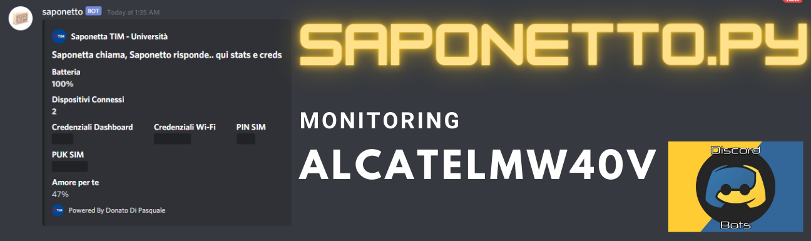

# saponetto-monitoring-modem



## A cosa potrebbe servirti saponetto?
Saponetto controlla il tuo modem alcatel , ti dà una overview dello stato attuale e ti avvisa se il modem scende sotto una determinata soglia, che decidi tu!

Saponetto può essere avviato su qualunque dispositivo che supporti python3.

Fai partire saponetto su un dispositivo connesso al modem e lui ti invierà tutte le informazioni su Discord!

## pre-requisiti

+ ModemAlcatelMW40V

+ pip3 install requirements.txt

+ prendere webhook di un canale testuale di discord

+ riempire campi nel file config che verrà creato al primo avvio


## uso
python3 saponetto.py -setMin 50 -setInt 5

```
> python3 saponetto.py -h
usage: saponetto.py [-h] -setMin SETMIN -setInt SETINT [-mode MODE]

MONITORING MODEM - Crea il tuo WebHook su Discord, riempi il file di configurazione ed avvia lo script!

optional arguments:
  -h, --help      show this help message and exit
  -setMin SETMIN  Imposta percentuale batteria per entrare in zona critica! -> -setMin 30
  -setInt SETINT  Imposta intervallo di controllo, espresso in minuti -> -setInt 5
  -mode MODE      COMING SOON...
```

